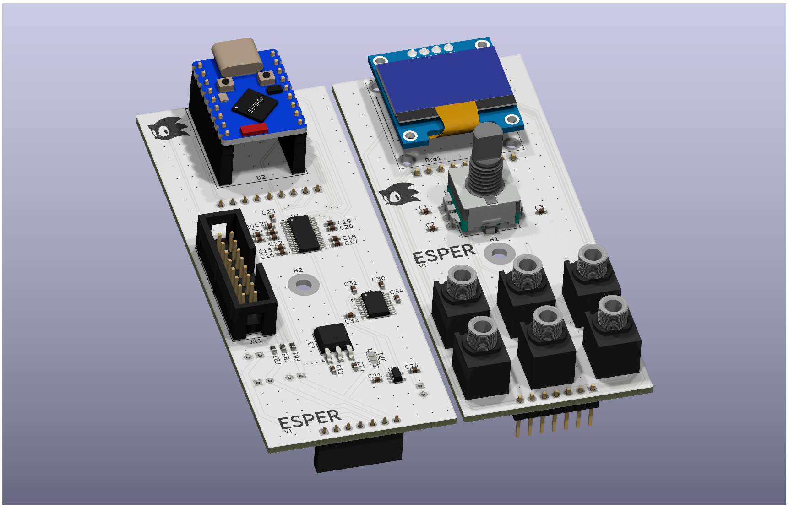

# Esper

An esp32 based eurorack module.

## Specifications

- 8HP width
- 4 CV inputs
- 2 Audio Outputs
- Oled Display with LVGL GUI
- Rotary Encoder with Push Button
- Esp32s3 has 2 cores, Bluetooth and Wifi support

## Photos

## Future Plans and Issues

- Better alternative to external adc for cv inputs
- Codec chip for both audio in and out, to allow for audio processing
- The esp32s3 floating point performance is not great